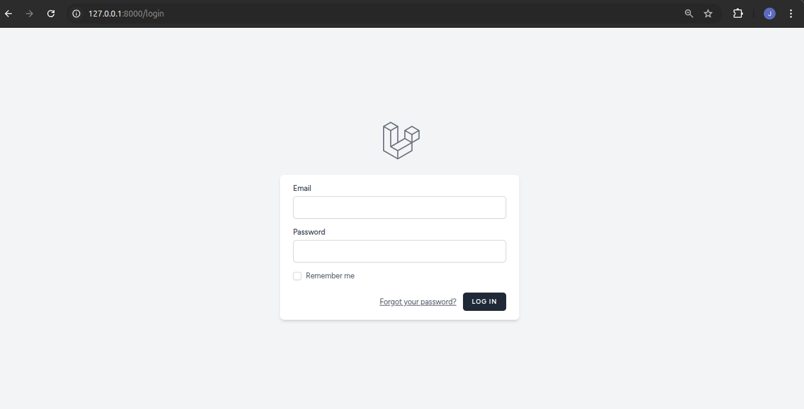
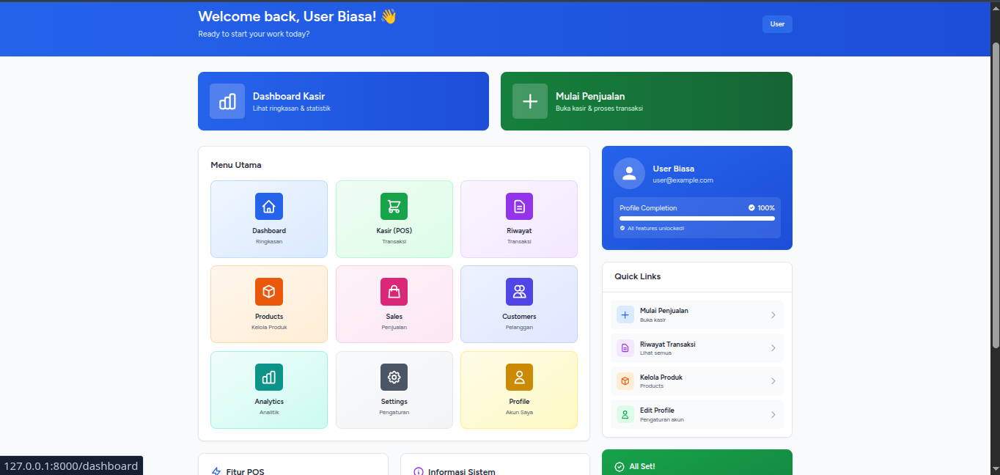
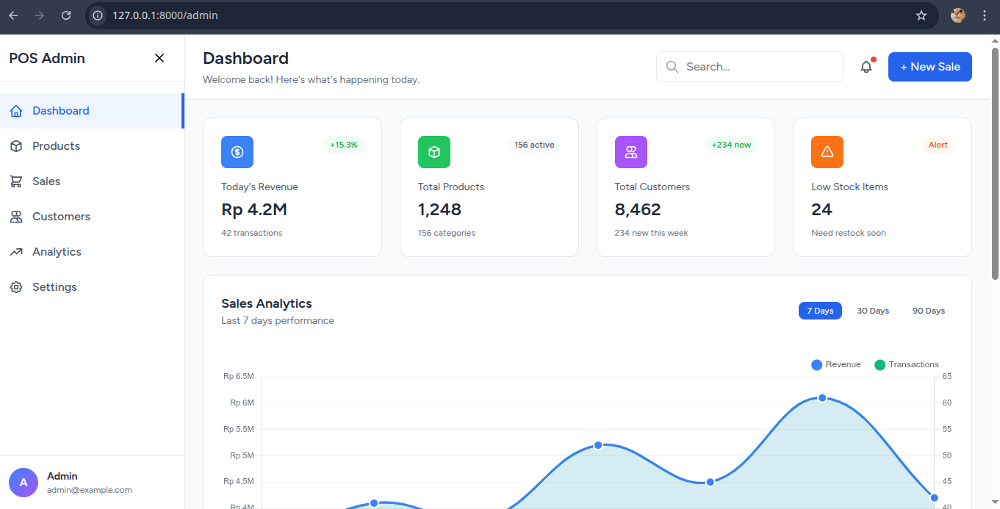
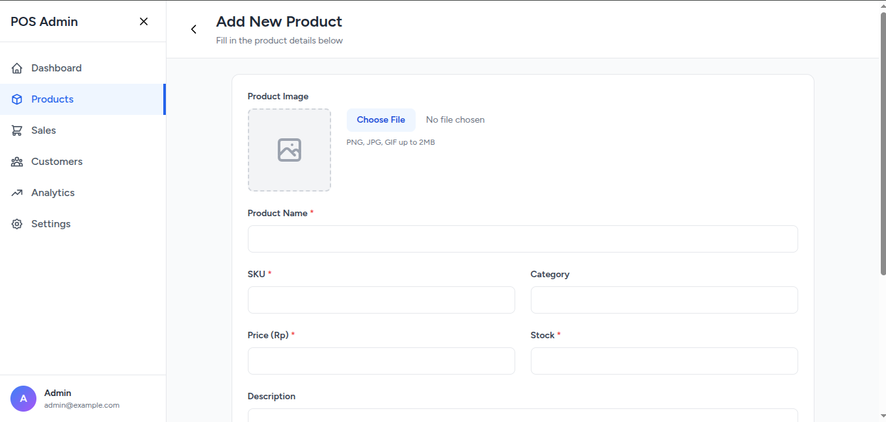
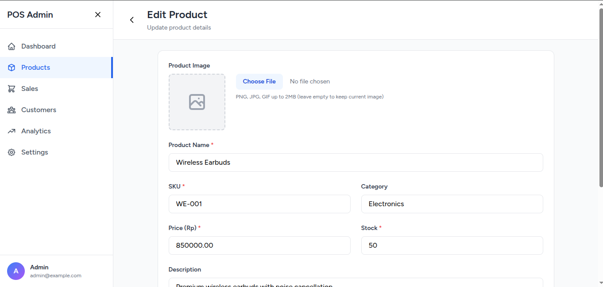
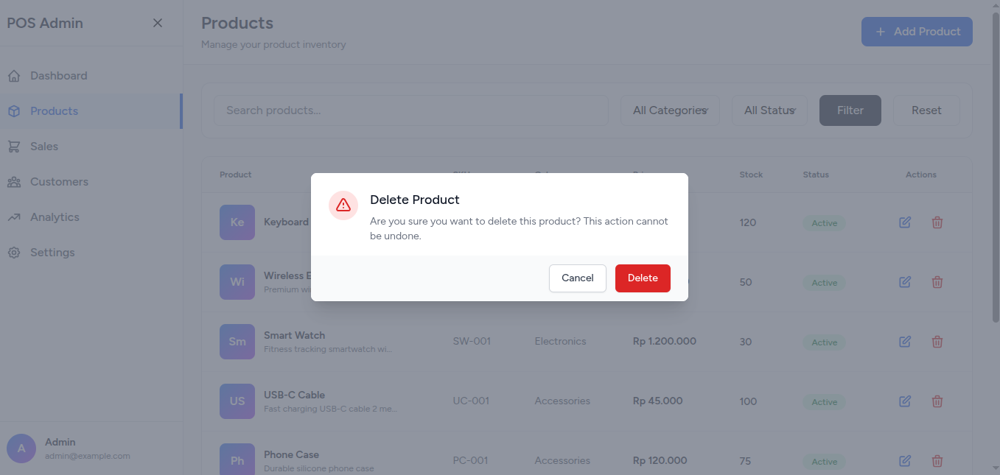
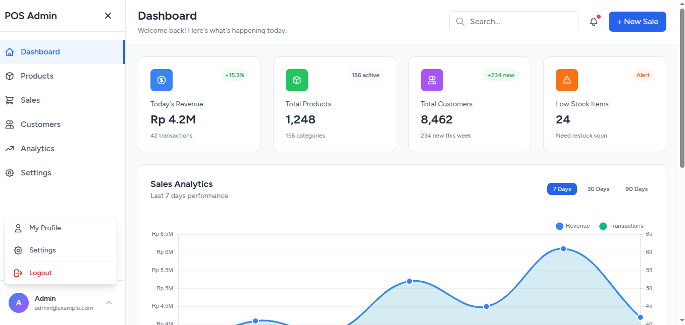
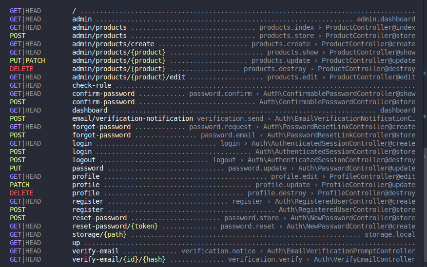

# 🛒 E-Business Laravel — Role Based Access Control

<div align="center">
**Implementasi Role-Based Access Control (RBAC) menggunakan Laravel Breeze & Custom Middleware**

Dibuat oleh: **Pangestu Aji Nugroho**  
Mata Kuliah: **E-Business**

</div>

---

## 📋 Daftar Isi

- [Fitur Utama](#-fitur-utama)
- [Screenshot Aplikasi](#-screenshot-aplikasi)
- [Teknologi](#-teknologi-yang-digunakan)
- [Instalasi](#-instalasi)
- [Route Structure](#-route-structure)

---

## ✨ Fitur Utama

### 🔐 Authentication System
- **Login & Register** menggunakan Laravel Breeze
- Password hashing dengan bcrypt
- Session management

### 👥 Role-Based Access Control
- **2 Role**: `user` dan `admin`
- Middleware `AdminMiddleware` untuk proteksi route admin
- Default role: `user` saat registrasi

### 🎯 Dashboard
- **User Dashboard** (`/dashboard`) - Akses untuk user biasa
- **Admin Dashboard** (`/admin`) - Akses eksklusif untuk admin

### 📦 Product Management (Admin Only)
- Tambah produk baru
- Edit produk existing
- Hapus produk
- View semua produk

---

## 📸 Screenshot Aplikasi

### 🔑 Login Page


> Halaman autentikasi dengan form login yang clean dan modern

---

### 👤 User Dashboard


> Dashboard untuk user biasa dengan akses terbatas

---

### 🛠️ Admin Dashboard


> Dashboard admin dengan sidebar navigasi lengkap dan statistik real-time

---

### ➕ Product Management

<table>
  <tr>
    <td width="50%">
      
      <p align="center"><b>Tambah Produk Baru</b></p>
    </td>
    <td width="50%">
      
      <p align="center"><b>Edit Produk</b></p>
    </td>
    <td width="50%">
      
      <p align="center"><b>Delete Produk</b></p>
    </td>
  </tr>
</table>

---

### 🎨 Improved Sidebar


> Sidebar dengan logout dropdown yang dinamis dan responsive

---

### 🛣️ Route Structure


> Output dari `php artisan route:list` menunjukkan struktur routing yang terorganisir

**Route Protection:**
- ✅ Middleware `admin` aktif pada route `/admin`
- ✅ Middleware `auth` untuk semua protected routes
- ✅ Guest middleware untuk login/register

---

## 🔧 Teknologi yang Digunakan

| Teknologi | Versi | Kegunaan |
|-----------|-------|----------|
| **Laravel** | 12.x | Backend Framework |
| **Laravel Breeze** | Latest | Authentication Scaffolding |
| **PHP** | 8.2+ | Programming Language |
| **MySQL** | 8.0+ | Database Management |
| **Tailwind CSS** | 3.x | Styling Framework |
| **Alpine.js** | 3.x | Interactive Components |

---

## 📥 Instalasi

```bash
# Clone repository
git clone https://github.com/yourusername/ebusiness2_nama_kalian.git
cd ebusiness2_nama_kalian

# Install dependencies
composer install
npm install

# Setup environment
cp .env.example .env
php artisan key:generate

# Database setup
php artisan migrate

# Compile assets
npm run dev

# Run server
php artisan serve
```

### 👤 Default Admin Account
Setelah migration, buat admin manual via Tinker:
```bash
php artisan tinker
```
```php
User::create([
    'name' => 'Admin',
    'email' => 'admin@example.com',
    'password' => bcrypt('password'),
    'role' => 'admin'
]);
```

---

## 🗂️ Struktur Database

### Users Table
```sql
- id (primary key)
- name (string)
- email (string, unique)
- password (string, hashed)
- role (enum: 'user', 'admin') DEFAULT 'user'
- created_at (timestamp)
- updated_at (timestamp)
```

---

## 🎓 Tentang Proyek

Proyek ini merupakan implementasi tugas mata kuliah **E-Business** yang berfokus pada:
- Implementasi Authentication & Authorization
- Role-Based Access Control (RBAC)
- CRUD Operations
- Middleware Custom di Laravel
- Best Practices dalam Web Development

---

## 👨‍💻 Developer

**Pangestu Aji Nugroho**  
Mata Kuliah: E-Business  
Tahun: 2024/2025

---

<div align="center">

### 📝 Catatan

Proyek ini dibuat untuk keperluan akademik dan pembelajaran.  
Jika ada pertanyaan atau saran, silakan buka issue di repository ini.

**⭐ Jangan lupa beri star jika bermanfaat!**

</div>