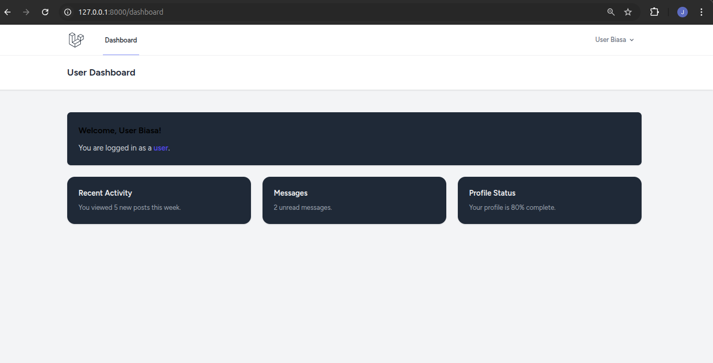
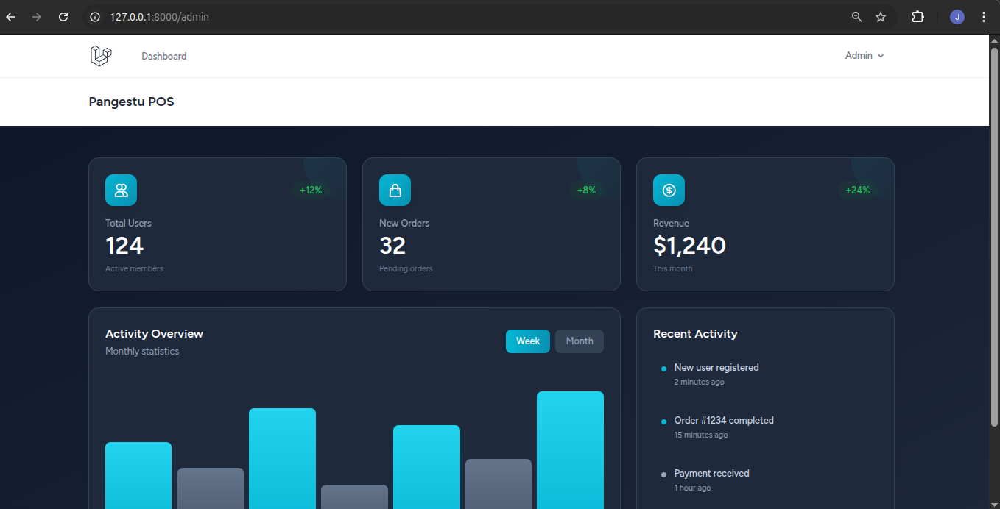

# 🛒 Proyek E-Business Laravel (ebusiness2_nama_kalian)

Proyek ini adalah implementasi tugas mata kuliah E-Business menggunakan framework Laravel, yang fokus pada **Role-Based Access Control (RBAC)** menggunakan Laravel Breeze dan Middleware.

---

## 🚀 Implementasi Tugas

Berikut adalah poin-poin tugas yang telah diimplementasikan:

1.  **Repository Setup:** Repository GitHub dibuat dengan nama `ebusiness2_nama_kalian`.
2.  **Laravel Project:** Project Laravel baru telah dibuat dan di-_push_ ke GitHub.
3.  **Authentication:** Laravel Breeze telah diinstal untuk fungsionalitas Login & Register.
4.  **Database:** Kolom `role` telah ditambahkan pada tabel `users` dengan nilai *default* **`user`**.
5.  **Role Access Control (No. 6):**
    * **Middleware `AdminMiddleware`** telah dibuat untuk memverifikasi `role` pengguna.
    * Route **`/dashboard`** diakses oleh **user biasa**.
    * Route **`/admin`** hanya dapat diakses oleh **admin** (dilindungi oleh `AdminMiddleware`).

---

## 📸 Dokumentasi Screenshot

Berikut adalah _screenshot_ sebagai bukti penyelesaian tugas (termasuk penerapan `AdminMiddleware`).

> **Catatan:** Semua file gambar disimpan di folder `/screenshots`.

### 1. Halaman Login

### 2. Dashboard User (/dashboard)
Hanya menampilkan Dashboard dasar bagi pengguna dengan role `user`.

### 3. Dashboard Admin (/admin)
Hanya dapat diakses setelah login dan memiliki role `admin`.

### 4. Hasil `php artisan route:list`
Verifikasi penerapan Middleware **`admin`** pada _route_ `/admin`.
[Screenshot Route List](screenshots/Route_list.png)

GET|HEAD  / ................................................................................... 
  GET|HEAD  admin ............................................................... admin.dashboard
  GET|HEAD  confirm-password ......... password.confirm › Auth\ConfirmablePasswordController@show
  POST      confirm-password ........................... Auth\ConfirmablePasswordController@store
  GET|HEAD  dashboard ................................................................. dashboard
  POST      email/verification-notification verification.send › Auth\EmailVerificationNotificati…
  GET|HEAD  forgot-password .......... password.request › Auth\PasswordResetLinkController@create
  POST      forgot-password ............. password.email › Auth\PasswordResetLinkController@store
  GET|HEAD  login ............................ login › Auth\AuthenticatedSessionController@create
  POST      login ..................................... Auth\AuthenticatedSessionController@store
  POST      logout ......................... logout › Auth\AuthenticatedSessionController@destroy
  PUT       password ........................... password.update › Auth\PasswordController@update
  GET|HEAD  profile ....................................... profile.edit › ProfileController@edit
  PATCH     profile ................................... profile.update › ProfileController@update
  DELETE    profile ................................. profile.destroy › ProfileController@destroy
  GET|HEAD  register ............................ register › Auth\RegisteredUserController@create
  POST      register ........................................ Auth\RegisteredUserController@store
  POST      reset-password .................... password.store › Auth\NewPasswordController@store
  GET|HEAD  reset-password/{token} ........... password.reset › Auth\NewPasswordController@create
  GET|HEAD  storage/{path} ........................................................ storage.local
  GET|HEAD  up .................................................................................. 
  GET|HEAD  verify-email ........... verification.notice › Auth\EmailVerificationPromptController
  GET|HEAD  verify-email/{id}/{hash} ........... verification.verify › Auth\VerifyEmailController