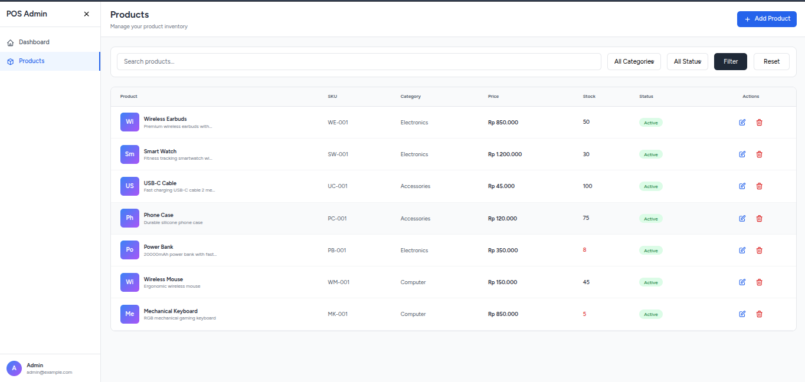

# 🛒 Proyek E-Business Laravel — Role Based Access Control  
**Pangestu Aji Nugroho**

Proyek ini merupakan implementasi tugas mata kuliah **E-Business**, dengan fokus pada penerapan **Role-Based Access Control (RBAC)** menggunakan Laravel Breeze dan Middleware.

---

## 🚀 Fitur yang Diimplementasikan

### ✔ 1. Repository & Setup  
- Repository GitHub dibuat dengan nama **`ebusiness2_nama_kalian`**.  
- Project Laravel baru dibuat dan dipush ke repository.

### ✔ 2. Authentication  
- Menggunakan **Laravel Breeze** untuk Login & Register.

### ✔ 3. Database  
- Menambahkan kolom `role` pada tabel `users`  
  - Default: `user`  
  - Nilai lain: `admin`

### ✔ 4. Role-Based Access Control  
- Middleware **`AdminMiddleware`** dibuat untuk membatasi akses admin.  
- Routing:  
  - `/dashboard` → hanya user biasa  
  - `/admin` → hanya role `admin`  

---

## 📸 Screenshot Aplikasi

Semua screenshot ada di folder **`/screenshots`**.

### 🔐 Halaman Login  

### 👤 Dashboard User (`/dashboard`)  

### 🛠 Dashboard Admin (`/admin`)  
Tampilan hanya dapat diakses oleh akun dengan role **admin**.

---

## 📌 Route List (php artisan route:list)

Output route menunjukkan bahwa:

- Middleware `admin` telah diterapkan pada route `/admin`
- Middleware Laravel default bekerja dengan baik
- Endpoint logout, profile, dan authentication berfungsi

---

## 🔧 Teknologi yang Digunakan
- Laravel 12  
- Laravel Breeze  
- PHP 8+  
- MySQL  
- Middleware (custom + bawaan Laravel)

---

## 👨‍💻 Developer  
**Pangestu Aji Nugroho**  
Proyek ini disusun untuk memenuhi tugas mata kuliah **E-Business**.

